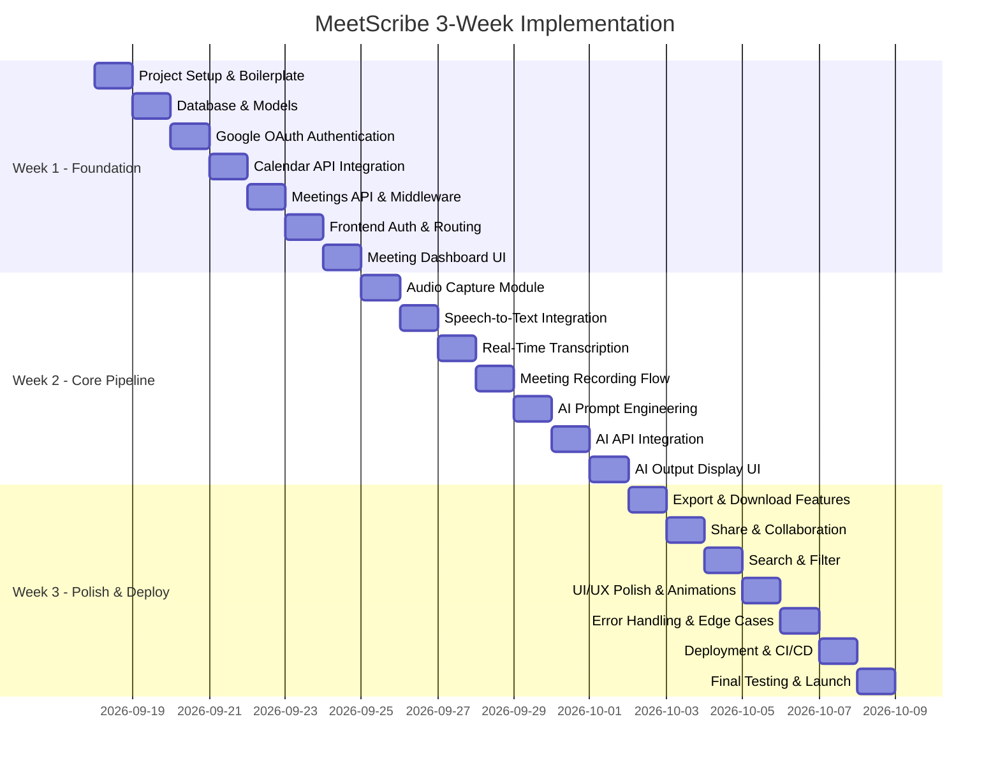

# MeetScribe — 3-Week Implementation Plan

> **Start Date**: September 18, 2026 (Thursday)  
> **End Date**: October 8, 2026 (Thursday)  
> **Working Days**: Monday – Sunday (21 days)

---

## Week 1: Foundation & Backend Core (Sep 18 – Sep 24)

> **Goal**: Set up the project, implement authentication, calendar integration, and the backend API.

---

### Day 1 — Thursday, Sep 18: Project Setup & Boilerplate

- [x] Initialize Git repository and create `.gitignore` (Linked to https://github.com/JayrajsinhBhatti/MeetScribe)
- [x] Set up backend project: `npm init`, install Express.js, dotenv, cors, nodemon
- [x] Set up frontend project: `npm create vite@latest` with React + TypeScript
- [x] Create folder structure for both frontend and backend
- [x] Set up ESLint and Prettier for both projects
- [x] Create environment variable templates (`.env.example`)
- [x] Write initial `README.md` with setup instructions

---

### Day 2 — Friday, Sep 19: Database Setup & User Model

- [x] Set up MongoDB Atlas cluster (or local MongoDB)
- [x] Install and configure Motor & Beanie ODM (Python async MongoDB)
- [x] Create `User` model schema (user_id, email, name, tokens, created_at)
- [x] Create `Meeting` model schema
- [x] Create `Transcript` model schema
- [x] Create `AIOutput` model schema
- [x] Test database connection and basic CRUD operations (`test_db.py`)

---

### Day 3 — Saturday, Sep 20: Google OAuth 2.0 Authentication

- [x] Create Google Cloud Console project and enable OAuth APIs
- [x] Configure OAuth consent screen and credentials
- [x] Configure FastAPI OAuth2 with Google Authlib
- [x] Implement `/api/v1/auth/google/url` route (initiate OAuth)
- [x] Implement `/api/v1/auth/google/callback` route (handle tokens & JWT)
- [x] Store access & refresh tokens securely in database
- [x] Implement token refresh helper / middleware
- [x] Test full login/logout flow with Postman / Swagger UI

---

### Day 4 — Sunday, Sep 21: Google Calendar API Integration

- [x] Enable Google Calendar API in Cloud Console
- [x] Install `google-api-python-client` and `google-auth` packages
- [x] Create Calendar service module to fetch events
- [x] Implement `/api/v1/calendar/sync` endpoint
- [x] Filter events to extract only Google Meet meetings
- [x] Parse meeting data (title, time, participants, Meet link)
- [x] Save synced meetings to the `Meeting` collection
- [x] Handle pagination for users with many calendar events

---

### Day 5 — Monday, Sep 22: Meetings API & Backend Middleware

- [x] Implement `GET /api/meetings` — list all meetings (with pagination, filters)
- [x] Implement `GET /api/meetings/:id` — get single meeting details
- [x] Add authentication middleware to protect all `/api` routes
- [x] Add error handling middleware (centralized error responses)
- [x] Add request validation using Pydantic schemas
- [x] Implement meeting status logic (upcoming / completed / missed)
- [x] Write unit tests for meeting CRUD operations

---

### Day 6 — Tuesday, Sep 23: Frontend Authentication & Routing

- [x] Install React Router and set up page routing
- [x] Create Login page with "Sign in with Google" button
- [x] Implement OAuth redirect flow on the frontend
- [x] Store auth token (httpOnly cookie or secure localStorage)
- [x] Create authenticated route wrapper / protected routes
- [x] Set up Axios instance with auth interceptor
- [x] Create global auth context (React Context API)
- [x] Test end-to-end login flow (frontend ↔ backend)

---

### Day 7 — Wednesday, Sep 24: Meeting Dashboard UI

- [x] Design and implement the Dashboard layout (sidebar + main content)
- [x] Build the meeting list component (upcoming meetings section)
- [x] Build the past meetings section with status indicators
- [x] Create meeting card component (title, time, participants, join button)
- [x] Fetch and display meetings from the API
- [x] Add loading states and empty states
- [x] Implement auto-sync on dashboard load (trigger calendar sync)
- [x] Add responsive design for mobile and tablet views

---

## Week 2: Audio Capture, Transcription & AI Processing (Sep 25 – Oct 1)

> **Goal**: Implement the core meeting capture pipeline — audio recording, speech-to-text, and AI-powered content generation.

---

### Day 8 — Thursday, Sep 25: Audio Capture Module

- [ ] Research Web Audio API and MediaRecorder API
- [ ] Create an AudioCapture service class in the frontend
- [ ] Implement microphone permission request flow
- [ ] Implement start/stop recording functionality
- [ ] Capture audio as WebM/Opus or WAV format
- [ ] Create audio buffer chunking for streaming (5-second chunks)
- [ ] Add visual recording indicator (red dot, timer)
- [ ] Test audio capture in Chrome and Edge browsers

---

### Day 9 — Friday, Sep 26: Speech-to-Text Integration

- [ ] Set up Google Cloud Speech-to-Text API (or Whisper API)
- [ ] Create STT service module on the backend
- [ ] Implement audio upload endpoint: `POST /api/transcribe`
- [ ] Process audio chunks and convert to text
- [ ] Implement speaker diarization (basic, if supported)
- [ ] Return transcript segments with timestamps
- [ ] Handle errors: unsupported format, empty audio, API limits
- [ ] Test with sample audio files

---

### Day 10 — Saturday, Sep 27: Real-Time Transcription with Socket.IO

- [ ] Install and configure Socket.IO on backend and frontend
- [ ] Create WebSocket connection for live transcription
- [ ] Stream audio chunks from frontend to backend via WebSocket
- [ ] Process chunks in real-time through STT API
- [ ] Broadcast transcript segments back to the frontend
- [ ] Build live transcript panel UI (auto-scrolling text area)
- [ ] Display speaker labels and timestamps in live view
- [ ] Handle connection drops and reconnection logic

---

### Day 11 — Sunday, Sep 28: Meeting Recording Flow (End-to-End)

- [ ] Integrate audio capture with the "Join Meeting" button
- [ ] Open Google Meet in a new tab when user clicks join
- [ ] Start recording in the MeetScribe tab simultaneously
- [ ] Create "Stop Recording" / "End Meeting" button
- [ ] On stop: finalize transcript, save to database
- [ ] Implement `POST /api/meetings/:id/transcript` endpoint
- [ ] Store full transcript and audio file reference
- [ ] Update meeting status to "completed" after recording ends

---

### Day 12 — Monday, Sep 29: AI Processing — Prompt Engineering

- [ ] Set up Gemini API (or OpenAI GPT-4 API) credentials
- [ ] Create AI service module on the backend
- [ ] Design prompt for generating meeting **summary**
- [ ] Design prompt for extracting **action items** (with assignees)
- [ ] Design prompt for identifying **key decisions**
- [ ] Design prompt for extracting **important points**
- [ ] Design prompt for generating **flashcards** (Q&A pairs)
- [ ] Design prompt for creating a full **meeting document**
- [ ] Test each prompt with sample transcripts and iterate

---

### Day 13 — Tuesday, Sep 30: AI Processing — API Integration

- [ ] Implement `POST /api/meetings/:id/process` endpoint
- [ ] Send transcript to AI with each prompt sequentially (or parallel)
- [ ] Parse AI responses into structured JSON
- [ ] Save all outputs to the `AIOutput` collection in MongoDB
- [ ] Handle API rate limits and errors gracefully
- [ ] Add retry logic for failed AI calls
- [ ] Implement `GET /api/meetings/:id/outputs` endpoint
- [ ] Test full pipeline: transcript → AI → stored output

---

### Day 14 — Wednesday, Oct 1: AI Output Display UI

- [ ] Create Meeting Detail page (route: `/meetings/:id`)
- [ ] Build tabbed interface: Summary | Action Items | Decisions | Flashcards | Document
- [ ] Display summary with formatted text
- [ ] Display action items as a checklist with assignee tags
- [ ] Display key decisions as a highlighted list
- [ ] Display flashcards with flip animation (Q on front, A on back)
- [ ] Display full meeting document with markdown rendering
- [ ] Add "Re-process" button to regenerate AI outputs

---

## Week 3: Polish, Export, Search & Deployment (Oct 2 – Oct 8)

> **Goal**: Add export/share functionality, search, polish the UI/UX, and deploy the application.

---

### Day 15 — Thursday, Oct 2: Export & Download Features

- [ ] Implement PDF export for meeting documents (using `pdfkit` or `puppeteer`)
- [ ] Implement Markdown export (`.md` file download)
- [ ] Implement DOCX export (using `docx` npm package)
- [ ] Create `GET /api/meetings/:id/export?format=pdf|md|docx` endpoint
- [ ] Add download buttons on the Meeting Detail page
- [ ] Add "Copy to Clipboard" for summary and action items
- [ ] Test all export formats for correctness and styling

---

### Day 16 — Friday, Oct 3: Share & Collaboration Features

- [ ] Implement shareable link generation for meeting outputs
- [ ] Create public read-only view for shared meeting documents
- [ ] Add "Share via Email" button (mailto link or SendGrid API)
- [ ] Implement access control: only meeting owner can share
- [ ] Add meeting tagging system (e.g., "sprint-review", "1-on-1")
- [ ] Build tag filter on the dashboard
- [ ] Store share settings in the Meeting model

---

### Day 17 — Saturday, Oct 4: Search & Filter Functionality

- [ ] Implement full-text search across transcripts and AI outputs
- [ ] Create `GET /api/meetings/search?q=...` endpoint
- [ ] Add search bar to the dashboard UI
- [ ] Display search results with highlighted matching text
- [ ] Add filters: date range, meeting status, tags
- [ ] Implement sort options: newest first, oldest first, relevance
- [ ] Add MongoDB text indexes for performance

---

### Day 18 — Sunday, Oct 5: UI/UX Polish & Animations

- [ ] Refine color scheme, typography, and spacing across all pages
- [ ] Add loading skeletons for async data
- [ ] Add transition animations between pages
- [ ] Implement dark mode toggle
- [ ] Add toast notifications for actions (sync, export, share)
- [ ] Improve mobile responsiveness
- [ ] Add empty states with illustrations
- [ ] Add favicon, app title, and meta tags for SEO

---

### Day 19 — Monday, Oct 6: Error Handling & Edge Cases

- [ ] Add global error boundary in React
- [ ] Handle expired Google tokens (auto-refresh or re-login prompt)
- [ ] Handle network offline state gracefully
- [ ] Add user feedback for failed API calls
- [ ] Validate all form inputs and API parameters
- [ ] Handle very long meetings (transcript size limits)
- [ ] Handle meetings with no audio (show appropriate message)
- [ ] Write integration tests for critical flows

---

### Day 20 — Tuesday, Oct 7: Deployment & CI/CD

- [ ] Configure production environment variables
- [ ] Build frontend for production: `npm run build`
- [ ] Deploy frontend to Vercel (connect GitHub repo)
- [ ] Deploy backend to Railway or Render
- [ ] Set up MongoDB Atlas production cluster (if not already)
- [ ] Configure CORS for production domain
- [ ] Set up Google OAuth redirect URIs for production
- [ ] Test full application flow on production URLs
- [ ] Set up basic CI/CD pipeline (GitHub Actions)

---

### Day 21 — Thursday, Oct 8: Final Testing, Documentation & Launch

- [ ] Run full end-to-end smoke test on production
- [ ] Test OAuth flow, calendar sync, recording, AI processing, and export
- [ ] Fix any remaining bugs found during testing
- [ ] Update `README.md` with final setup instructions, architecture diagram, and screenshots
- [ ] Write API documentation (Swagger/OpenAPI or Postman collection)
- [ ] Create a demo video or GIF walkthrough
- [ ] Prepare presentation for BOB-a-thon
- [ ] 🚀 **Launch MeetScribe**

---

## Summary Timeline

---

## Risk Mitigation

| Risk | Mitigation |
|---|---|
| Google API rate limits | Implement caching and batch requests; add exponential backoff |
| Audio capture browser compatibility | Test early on target browsers; provide fallback upload option |
| AI output quality varies | Iterate on prompts; add "re-process" option; allow manual edits |
| Scope creep | Stick to MVP features in this plan; defer nice-to-haves to v2 |
| STT accuracy issues | Allow manual transcript editing; test with diverse audio samples |

---

> **Note**: Each day includes approximately 6–8 hours of focused development work. Tasks are ordered by dependency — earlier days build the foundation that later days rely on.
