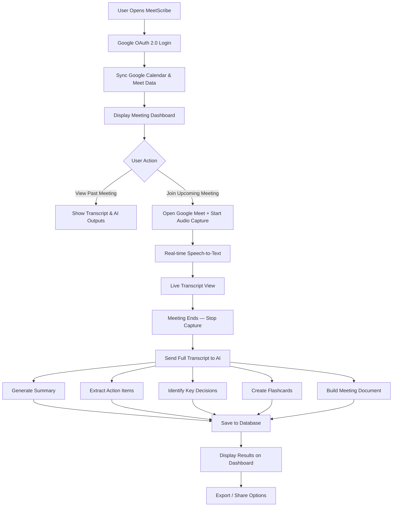

# MeetScribe — Project Requirements & Flow

## 1. Project Overview

**MeetScribe** is an AI-powered web application that integrates with **Google Meet** and **Google Calendar** to provide a unified meeting management experience. It captures meeting speech in real-time, converts it to text, and uses AI to produce structured, actionable outputs such as summaries, action items, flashcards, and meeting documents.

---

## 2. Problem Statement

Professionals attend multiple meetings daily but struggle to:
- Track upcoming meetings across calendars
- Capture and retain important discussion points
- Extract action items and key decisions reliably
- Share structured meeting notes with team members

MeetScribe solves this by automating the entire pipeline — from meeting discovery to AI-generated documentation.

---

## 3. Core Features

### 3.1 Authentication & Authorization
- Google OAuth 2.0 sign-in
- Scopes: Google Calendar (read), Google Meet (join/manage), Gmail (optional for sharing)
- Secure token storage and refresh flow

### 3.2 Calendar & Meeting Sync
- Fetch all Google Calendar events that are Google Meet meetings
- Display upcoming and past meetings in a unified dashboard
- Real-time sync with calendar changes (polling or push notifications)

### 3.3 Meeting Dashboard
- List view of upcoming meetings (date, time, title, participants)
- Past meetings with associated transcripts and AI outputs
- Quick-join button to enter Google Meet directly from the app

### 3.4 Speech Capture & Transcription
- Capture meeting audio via browser (Web Audio API / MediaRecorder)
- Real-time Speech-to-Text conversion (Google Cloud Speech-to-Text or Whisper API)
- Speaker diarization (identify who said what)
- Live transcript view during the meeting

### 3.5 AI-Powered Processing
After a meeting ends, the transcript is processed by an AI model (e.g., Gemini, GPT-4) to generate:

| Output | Description |
|---|---|
| 📝 **Meeting Document** | Structured document with transcript, summary, decisions, and discussion points |
| 📋 **Summary** | Concise overview of what was discussed |
| 📌 **Important Points** | Key highlights and noteworthy statements |
| ✅ **Action Items** | Tasks assigned to specific people with context |
| 🔑 **Key Decisions** | Decisions made during the meeting |
| 🧠 **Flashcards** | Q&A style cards for review and retention |

### 3.6 Output Management
- View, edit, and export AI-generated outputs (PDF, Markdown, DOCX)
- Share outputs via email or link
- Search across past meeting content
- Tag and categorize meetings

---

## 4. Application Flow



---

## 5. Tech Stack

| Layer | Technology |
|---|---|
| **Frontend** | React.js (with Vite), Tailwind CSS or Material UI |
| **Backend** | Node.js + Express.js (REST API) |
| **Database** | MongoDB (documents & transcripts) |
| **Authentication** | Google OAuth 2.0 (via Passport.js or Firebase Auth) |
| **Calendar API** | Google Calendar API v3 |
| **Speech-to-Text** | Google Cloud Speech-to-Text API / OpenAI Whisper |
| **AI Processing** | Google Gemini API / OpenAI GPT-4 API |
| **Audio Capture** | Web Audio API + MediaRecorder API |
| **Real-time** | Socket.IO (live transcript streaming) |
| **Storage** | Google Cloud Storage / AWS S3 (audio files) |
| **Deployment** | Vercel (frontend) + Railway/Render (backend) |

---

## 6. Data Models

### 6.1 User
```json
{
  "userId": "string",
  "email": "string",
  "name": "string",
  "googleTokens": {
    "accessToken": "string",
    "refreshToken": "string"
  },
  "createdAt": "datetime"
}
```

### 6.2 Meeting
```json
{
  "meetingId": "string",
  "userId": "string",
  "title": "string",
  "scheduledAt": "datetime",
  "duration": "number (minutes)",
  "participants": ["string"],
  "meetLink": "string",
  "calendarEventId": "string",
  "status": "upcoming | completed | missed"
}
```

### 6.3 Transcript
```json
{
  "transcriptId": "string",
  "meetingId": "string",
  "segments": [
    {
      "speaker": "string",
      "text": "string",
      "timestamp": "number (seconds)"
    }
  ],
  "fullText": "string",
  "audioFileUrl": "string"
}
```

### 6.4 AI Output
```json
{
  "outputId": "string",
  "meetingId": "string",
  "summary": "string",
  "actionItems": [
    {
      "assignee": "string",
      "task": "string"
    }
  ],
  "keyDecisions": ["string"],
  "importantPoints": ["string"],
  "flashcards": [
    {
      "question": "string",
      "answer": "string"
    }
  ],
  "meetingDocument": "string (markdown/html)",
  "generatedAt": "datetime"
}
```

---

## 7. API Endpoints (High-Level)

| Method | Endpoint | Description |
|---|---|---|
| `GET` | `/auth/google` | Initiate Google OAuth flow |
| `GET` | `/auth/google/callback` | OAuth callback handler |
| `GET` | `/api/meetings` | List all meetings for authenticated user |
| `GET` | `/api/meetings/:id` | Get meeting details with outputs |
| `POST` | `/api/meetings/:id/transcript` | Upload/save transcript |
| `POST` | `/api/meetings/:id/process` | Trigger AI processing on transcript |
| `GET` | `/api/meetings/:id/outputs` | Get AI-generated outputs |
| `GET` | `/api/meetings/:id/export` | Export meeting document |
| `POST` | `/api/calendar/sync` | Force calendar re-sync |

---

## 8. Non-Functional Requirements

- **Security**: All tokens encrypted at rest; HTTPS enforced; CORS configured
- **Performance**: Transcription latency < 2 seconds; AI processing < 30 seconds
- **Scalability**: Stateless backend; horizontal scaling via containers
- **Accessibility**: WCAG 2.1 AA compliance for the dashboard
- **Privacy**: Audio files deleted after processing (configurable retention)

---

## 9. Example Scenario

> **Meeting**: "AI Project Discussion — 2:00 PM"
>
> After the meeting, MeetScribe produces:
>
> **Summary**: Discussed the architecture of the AI chatbot and decided to use RAG for document retrieval.
>
> **Action Items**:
> - Jayraj → Implement document ingestion
> - Person 2 → Prepare embedding pipeline
> - Team → Test retrieval accuracy
>
> **Flashcards**:
> - **Q**: What architecture was selected for document retrieval?
> - **A**: RAG (Retrieval-Augmented Generation).
>
> **Meeting Document**: A structured document containing the transcript, summary, decisions, action items, and important discussion points.
